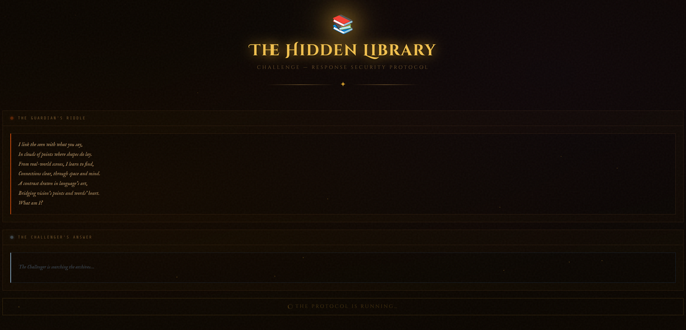
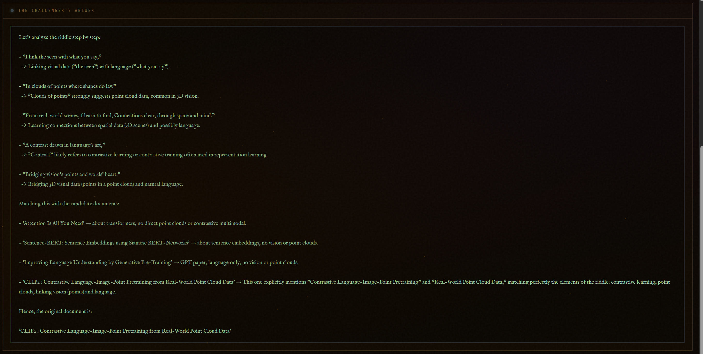

# Summary

A microservice-based architecture that fully isolates two cooperating yet hostile agents:

- Guardian (the Lock): selects a hidden document and issues a contextual riddle.  
- Challenger (the Key): receives only the riddle text, deduces the source, and submits title + answers.  

#### Core components:

**Data Layer**: arXiv + PubMed ingestion → PDF/text parser → metadata store + vector store (Qdrant).  
**Retrieval**: hybrid dense (abstract embeddings) + lexical (BM25). Plus a re-ranker.  
**Agents**: custom orchestrator (no black-box agent framework; DDD + SOLID).  
**LLMs**: hosted API (e.g. OpenAI via Azure Databricks), rate-limited & audited.  

# Sample

### The guardian creates a riddle for the challenger



### The challenger has to interpret the riddle and give their response




# Component - Data Ingestion

To make things more interesting, I’ll pull from two rich, open‐access scientific libraries: ArXiv and PubMed. Both are constantly growing and well-documented.

## Pipeline

1. Build a standalone “Data Service” that maintains a text-search-optimized database.  
   
   - On-prem / local vector store (e.g. Qdrant) or cloud (Azure AI Search on Databricks...) .  
   - This service is fully decoupled from the multi-agent logic. It can be Dockerized and deployed as a container app.

2. In that service we expose these core endpoints via a simple backend (e.g. FastAPI):  
   
   - `upsert_document`  
   - `query_documents`  
   - `update_document`  
     Plus handy extras: `delete_document`, and an auto-update cron job to fetch recent uploads(e.g. nightly refresh).

3. Data ingestion pipeline  
   
   - Use PubMed/ArXiv public APIs for asynchronous scraping, respecting rate limits and logging all errors.  
   - Let's say that input formats come in as PDF/Word manuscripts. We have three options for parsing:  
     1. Open-source text+image extractors we assemble ourselves (pypdf, docling...)  
     2. Cloud-hosted parsers (e.g. Azure Document Intelligence with custom templates)  
     3. VLM-based extraction (visual models) + a fallback text-extractor  
   - Do a simple page-based chunking (no overlap) to keep context windows manageable.

4. Document model  
   
   ```python
   class Document(BaseModel):
        title: str
        abstract: str
        author: str
        year: int
        textual_context: str  # or just a blob-storage path
        embedding: List[float]
        extra: dict
   ```
   
   ##### Notes
   
   - We only generate & store an embedding for the **abstract** (cost, scalability & vector quality).  
   - `textual_context` can point to the raw PDF in blob storage to avoid bloating the DB.  
   - `extra` is a flexible bucket to attach dynamic metadata later (e.g. pre-generated hints).

> Note on “extra”: I initially toyed with HyDE-style question generation at ingest time, but it seemed way too costly. Instead, we’ll generate hints on-demand and store them here when needed.

# Component - Agentic Architecture

We’re building two completely isolated AI agents: Guardian (lock) vs. Challenger (key), both talking only via natural-language riddles.

## Core Stack Decisions

- LLM Provider: External (OpenAI via Azure/Databricks).  
- Agent Framework: Custom orchestration code (not LangChain or similar), to retain 100% control over logging, tracing, retry policies, etc.  
- Code Organization: Domain-Driven Design + SOLID principles. Each agent is a small, testable component.

---

## The Guardian (The Lock)

1. Retrieval tool -> pick one random Document  
2. **DocumentRiddler Agent** (LLM-based)  
   - Crafts a riddle about plot‐points, themes or facts using any available fields (title disguised, authors omitted, etc.).  
3. **Validator Agent** (rule-based)  
   - If Challenger guesses correctly: mock them for making it too easy.  
   - If wrong: reissue a tougher riddle (include user’s bad guess).  
   - Track max retries; if exceeded, berate the Challenger for failing.

> Caveat: This flow is vulnerable to prompt-injection attacks. In prod we’d insert a “filter/validator” agent that blocks any negative or leading prompts and ensures only our safe template is rendered.

---

## The Challenger (The Key)

1. **Riddle To Template Agent**  
   
   - Parse the riddle into a structured “template” (e.g. inferred topic, year, keywords).  
   - Example simple model:
     
     ```python
     class Template(BaseModel):
         topic: str
         year: Optional[int]
     ```
   - Carries over past rounds to refine guessed fields.

2. **Information Retrieval Agent**  
   
   - Semantic search on `abstract` embeddings (vector store).  
   - Lexical/BM25 search on full text.  
   - Returns top-10 from each.

3. **Document Reranker Agent**  
   
   - Feeds top candidates into an LLM (or cross-encoder) that judges:  
     - Which title + abstract best match the template + riddle  
   - Picks the final best candidate.

4. Submit “Book Title” answer back to the Guardian.

---

## Sample Conversational Flow

Guardian

> "Generic Riddle Master talk about having the knowledge" (Not actual functionality)

Challenger

> "I challenge you" (Not actual functionality)

Guardian

> **Document Riddle Agent**

Challenger

> **Riddle to Template Agent**
> 
> **Information Retrieval Agent**
> 
> **Documet Reranker Agent**

Guardian

> "**Validator Agent**"

THEN:

> Repeat loop

    or

> Finish the interaction

# Component - System Architecture & Clean-Room Enforcement

- Single backend service (FastAPI) with two public API surfaces:  
  
  - `/guardian/riddle` & `/guardian/validate`  
  - `/challenger/solve` (one shot per riddle)  

- Under the hood we have:  
  
  1. DataService (vector store + blob storage)  
  2. Agent Orchestrator (dispatches sub-agents, handles retries, logging, tracing)  
  3. LLM Connector Layer (abstracts prompt templates, rate limits, error handling)

- **Clean-Room** is enforced by:  
  
  - Strict separation of Guardian vs. Challenger code modules & credentials  
  - Each only has access to the DataService in very limited ways:  
    - Guardian: random‐pick + riddle meta  
    - Challenger: structured DB queries, no direct read of riddle document  
  - No shared in-memory state, no back-doors. Everything goes through well-defined API contracts.

## Final Notes

If we scaled to 10 M documents, the same pattern holds but I'll add one extra detail:  

- Shard the vector store, add index clusters to improve latency